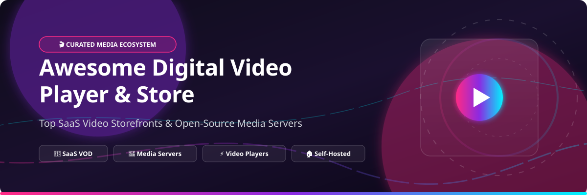

  

# 🎬 Awesome Digital Video Player & Store

  
  
  
  
  

> 🚀 **Curated List of SaaS Platforms & Open-Source GitHub Projects for Video Storefronts, Media Servers, Open-Source Video Players & Self-Hosted Streaming.**

**📅 Last updated: October 2026**

This repository tracks notable **SaaS commercial platforms**, **open-source video players**, and **self-hosted media servers** in the digital video ecosystem. Whether you want to stream commercial movies, deploy a personal HTPC, embed high-performance web video players, or build a private cloud video streaming hub, this list curates top industry and community tools.

---

## 📖 Table of Contents
- [💼 Commercial SaaS & Hosted Video Storefronts](#-commercial-saas--hosted-video-storefronts)
- [🔓 Open-Source Media Servers & Video Players](#-open-source-media-servers--video-players)
- [🤝 How to Contribute](#-how-to-contribute)
- [💖 Support & Sponsorship](#-support--sponsorship)
- [⚠️ Disclaimer & Market Lifecycles](#%EF%B8%8F-disclaimer--market-lifecycles)
- [📊 Star History](#-star-history)

---

## 💼 Commercial SaaS & Hosted Video Storefronts

> **📈 Sector Market Size & Dynamics**: The global Digital Video & Streaming market is estimated at **$550 Billion+ (2026)**, spanning Transactional Video-on-Demand (TVOD), Subscription Video-on-Demand (SVOD), and Free Ad-Supported Streaming TV (FAST). The sector is **moderately fragmented** with major tech giants holding concentrated distribution channels alongside independent streaming hubs. Major platform changes include:
> - **Microsoft Movies & TV**: Permanently shut down new sales on **July 18, 2025**.
> - **Google Play Movies & TV**: Fully migrated into **Google TV** and **YouTube Movies**.
> - **Apple TV**: Consolidated iTunes Movies and TV apps into the unified **Apple TV App** (tvOS 26.4).
> - **Fandango**: Unified Vudu / Fandango at Home under the main **Fandango** brand.

*Sorted by Company Revenue / Parent Size (Descending):*

| Platform | Description | Pricing (Starting Tier) | Free Tier / Trial Limits | Company Size (Revenue / Valuation) |
| :--- | :--- | :--- | :--- | :--- |
| **[Amazon Prime Video](https://www.amazon.com/primevideo)** | **Amazon's streaming hub & TVOD store.** Stream Prime originals or rent/buy movie releases. | **$14.99/month** (Prime subscription) or **$2.99–$19.99** rental per title | **30-day free trial** for Amazon Prime; Free ad-supported content via **Freevee** | **~$638 Billion** (Amazon FY2025 Revenue) |
| **[Apple TV](https://www.apple.com/apple-tv-app/)** | **Apple's unified movie & TV storefront.** Hub for Apple TV+ originals and digital purchases. | **$15.00/month** (Apple TV+) or **$3.99–$19.99** rental per title | **7-day free trial** for Apple TV+; App is free on Apple devices | **~$400 Billion** (Apple FY2025 Revenue Est.) |
| **[Google TV](https://tv.google/)** | **Google's entertainment hub & digital store.** Replaced Google Play Movies & TV for rentals and buys. | **$2.99–$5.99** starting rental or **$4.99–$29.99** purchase per title | **10,000+ free ad-supported movies** & **300+ free live channels** via Google TV Freeplay | **~$350 Billion** (Alphabet FY2025 Revenue) |
| **[Google Play Movies](https://play.google.com/store/movies)** | **Legacy storefront.** Storefront deprecated; active purchases migrated to Google TV & YouTube. | **$2.99–$5.99** legacy rental tier | **14-day refund window** on unused digital rentals; free content via YouTube | **~$350 Billion** (Alphabet FY2025 Revenue) |
| **[Microsoft Movies & TV](https://www.microsoft.com/en-us/p/movies-tv/9wzdncrfj3p2)** | **Discontinued storefront (July 18, 2025).** New sales closed; past purchases viewable on Xbox/Windows. | **Storefront closed** (Past purchases retained) | **No active free tier** or new trials available | **~$281 Billion** (Microsoft FY2025 Revenue) |
| **[Hulu](https://www.hulu.com/)** | **Disney-owned streaming service.** Offers huge on-demand television libraries and live TV options. | **$9.99/month** (With Ads starting tier) or **$18.99/month** (No Ads) | **30-day free trial** for new & eligible returning subscribers | **~$12 Billion** (Disney Direct-to-Consumer Segment Revenue) |
| **[Roku](https://www.roku.com/)** | **Streaming device platform & digital media store.** Features extensive ad-supported channels. | **$0.00** for Roku Channel; Hardware devices start at **$29.99** | **10,000+ free movies, TV shows & live channels** on The Roku Channel | **~$3.5 Billion** (Roku FY2025 Revenue Est.) |
| **[Fandango](https://www.fandango.com/)** | **Movie ticket & digital VOD storefront.** Unified experience for home streaming (formerly Vudu). | **$0.99–$5.99** rental per title or **$4.99–$24.99** purchase per title | **10,000+ free ad-supported movies** & **3,500+ hours** of free TV/sports | **Private** (Fandango / NBCUniversal / Warner Bros. Discovery) |

---

## 🔓 Open-Source Media Servers & Video Players

The open-source video player and media server ecosystem is mature, production-proven, and actively maintained. From full-featured media servers to ultra-fast native video players and web streaming libraries, these projects give you total control over video playback and hosting.

*Sorted by GitHub Star Count (Descending):*

| Repo | Description | Stars |
| :--- | :--- | :--- |
| **[Immich](https://github.com/immich-app/immich)** | **High-performance self-hosted photo & video backup solution.** Features seamless video streaming, transcribing, and mobile sync. **AGPL-3.0**. |  |
| **[Jellyfin](https://github.com/jellyfin/jellyfin)** | **The leading free, open-source media server.** Zero premium paywalls, zero tracking, total library control. Supports hardware transcoding & cross-platform apps. **GPL-2.0**. |  |
| **[IINA](https://github.com/iina/iina)** | **The modern media player for macOS.** Built in Swift with a sleek native UI, picture-in-picture, subtitle downloading, and YouTube-DL integration. **GPL-3.0**. |  |
| **[Video.js](https://github.com/videojs/video.js)** | **World's most popular open-source HTML5 video player framework.** Powers thousands of web video streaming sites with custom skins and plugins. **Apache-2.0**. |  |
| **[mpv](https://github.com/mpv-player/mpv)** | **Lightweight, extremely powerful command-line media player.** High quality video output, GPU acceleration, and customizable Lua scripting. **GPL-2.0**. |  |
| **[Nextcloud Server](https://github.com/nextcloud/server)** | **Self-hosted productivity & media cloud platform.** High performance video player integration for streaming personal video collections. **AGPL-3.0**. |  |
| **[Navidrome](https://github.com/Navidrome/navidrome)** | **Modern open-source web-based media server.** Lightweight, fast stream processing, subsonic API compatible for personal audio/video catalogs. **GPL-3.0**. |  |
| **[Kodi](https://github.com/xbmc/xbmc)** | **Award-winning open-source home theater software.** HTPC media center with huge add-on library for local and network video playback. **GPL-2.0**. |  |
| **[VLC Media Player](https://github.com/videolan/vlc)** | **Universal cross-platform multimedia player.** Plays almost any video file format, disc, camera, device, or network stream natively. **GPL-2.0**. |  |
| **[HLS.js](https://github.com/video-dev/hls.js)** | **JavaScript HTTP Live Streaming (HLS) client.** Relies on HTML5 video and MediaSource Extensions for seamless adaptive web video playback. **Apache-2.0**. |  |
| **[Stremio Web](https://github.com/Stremio/stremio-web)** | **Web-based video streaming application.** Modern client UI for aggregating content streams and add-ons in one video dashboard. **GPL-3.0**. |  |
| **[Shaka Player](https://github.com/shaka-project/shaka-player)** | **Google's JavaScript library for adaptive video streaming.** Supports DASH and HLS with seamless DRM integration across browsers. **Apache-2.0**. |  |
| **[Clappr](https://github.com/clappr/clappr)** | **Extensible open-source media player for the web.** Built with HTML5 architecture, plugin architecture, and custom skin support. **BSD-3-Clause**. |  |
| **[Emby](https://github.com/MediaBrowser/Emby)** | **Personal media server repository.** Free core media organization with mobile/TV apps and optional Emby Premiere upgrade. **Custom**. |  |
| **[Plex Docker](https://github.com/plexinc/pms-docker)** | **Official Plex Media Server container distribution.** Self-host Plex with intuitive media streaming, mobile sync, and free FAST TV channels. **GPL-3.0**. |  |
| **[Stremio Shell](https://github.com/Stremio/stremio-shell)** | **Desktop shell container for Stremio video hub.** Cross-platform desktop media aggregator application. **GPL-3.0**. |  |

---

## 🤝 How to Contribute

Contributions are welcome! Please follow these simple guidelines:

1. 🍴 **Fork** this repository.
2. 📝 Edit `README.md` to add your suggested commercial storefront or open-source video project.
3. 🎯 Ensure entries include clear descriptions, proper links, and star badges for open-source projects.
4. 📬 Submit a **Pull Request** detailing your changes.

---

## 💖 Support & Sponsorship

If you found this curated list helpful for discovering video store platforms or self-hosted media servers, please consider supporting the project!

- ⭐️ **Star** this repository on GitHub
- 🔀 **Fork** and share it with fellow home theater & self-hosting enthusiasts
- ☕️ **Buy me a coffee**: Support ongoing open-source maintenance via [GitHub Sponsors](https://github.com/sponsors/ishandutta2007)

---

## ⚠️ Disclaimer & Market Lifecycles

- **Community Information**: This repository is a community-curated collection for educational and informational purposes.
- **Digital License Caveats**: Purchased movies or TV episodes on SaaS storefronts remain bound to vendor account availability. Movies Anywhere helps sync participating film titles across connected platforms, but television series currently lack cross-storefront licensing.
- **Open-Source Self-Hosting**: Open-source solutions such as Jellyfin, Kodi, and mpv provide full privacy and offline resilience for user-owned media, while commercial SaaS platforms offer expansive streaming catalogs and cloud synchronization.

---

## 📊 Star History

---

  Made with ❤️ for movie collectors, cord-cutters, home theater enthusiasts, and self-hosting developers worldwide.

